# Heart Disease Prediction

This dataset consists of health information/factors of patients which
will be used to create a predictive classification model using logistic
regression, elastic net, k-nearest neighbors, and random forest.

------------------------------------------------------------------------

## Packages Used & Loading dataset

``` r
library(tidyverse)
library(caret)
library(GGally)
library(corrplot)
library(fastDummies)
library(rsample)
library(glmnet)
library(gglasso)
library(car)
library(e1071)
library(randomForest)
heart_2020_cleaned <- as.data.frame(read_csv("E:/Github/Heart-Disease-Prediction/heart_2020_cleaned.csv", show_col_types=FALSE))
ds <- heart_2020_cleaned
```

------------------------------------------------------------------------

# Data Exploration

## Dataset Summary

``` r
summary(ds)
```

    ##  HeartDisease            BMI          Smoking          AlcoholDrinking   
    ##  Length:319795      Min.   :12.02   Length:319795      Length:319795     
    ##  Class :character   1st Qu.:24.03   Class :character   Class :character  
    ##  Mode  :character   Median :27.34   Mode  :character   Mode  :character  
    ##                     Mean   :28.33                                        
    ##                     3rd Qu.:31.42                                        
    ##                     Max.   :94.85                                        
    ##     Stroke          PhysicalHealth    MentalHealth    DiffWalking       
    ##  Length:319795      Min.   : 0.000   Min.   : 0.000   Length:319795     
    ##  Class :character   1st Qu.: 0.000   1st Qu.: 0.000   Class :character  
    ##  Mode  :character   Median : 0.000   Median : 0.000   Mode  :character  
    ##                     Mean   : 3.372   Mean   : 3.898                     
    ##                     3rd Qu.: 2.000   3rd Qu.: 3.000                     
    ##                     Max.   :30.000   Max.   :30.000                     
    ##      Sex            AgeCategory            Race             Diabetic        
    ##  Length:319795      Length:319795      Length:319795      Length:319795     
    ##  Class :character   Class :character   Class :character   Class :character  
    ##  Mode  :character   Mode  :character   Mode  :character   Mode  :character  
    ##                                                                             
    ##                                                                             
    ##                                                                             
    ##  PhysicalActivity    GenHealth           SleepTime         Asthma         
    ##  Length:319795      Length:319795      Min.   : 1.000   Length:319795     
    ##  Class :character   Class :character   1st Qu.: 6.000   Class :character  
    ##  Mode  :character   Mode  :character   Median : 7.000   Mode  :character  
    ##                                        Mean   : 7.097                     
    ##                                        3rd Qu.: 8.000                     
    ##                                        Max.   :24.000                     
    ##  KidneyDisease       SkinCancer       
    ##  Length:319795      Length:319795     
    ##  Class :character   Class :character  
    ##  Mode  :character   Mode  :character  
    ##                                       
    ##                                       
    ## 

``` r
str(ds)
```

    ## 'data.frame':    319795 obs. of  18 variables:
    ##  $ HeartDisease    : chr  "No" "No" "No" "No" ...
    ##  $ BMI             : num  16.6 20.3 26.6 24.2 23.7 ...
    ##  $ Smoking         : chr  "Yes" "No" "Yes" "No" ...
    ##  $ AlcoholDrinking : chr  "No" "No" "No" "No" ...
    ##  $ Stroke          : chr  "No" "Yes" "No" "No" ...
    ##  $ PhysicalHealth  : num  3 0 20 0 28 6 15 5 0 0 ...
    ##  $ MentalHealth    : num  30 0 30 0 0 0 0 0 0 0 ...
    ##  $ DiffWalking     : chr  "No" "No" "No" "No" ...
    ##  $ Sex             : chr  "Female" "Female" "Male" "Female" ...
    ##  $ AgeCategory     : chr  "55-59" "80 or older" "65-69" "75-79" ...
    ##  $ Race            : chr  "White" "White" "White" "White" ...
    ##  $ Diabetic        : chr  "Yes" "No" "Yes" "No" ...
    ##  $ PhysicalActivity: chr  "Yes" "Yes" "Yes" "No" ...
    ##  $ GenHealth       : chr  "Very good" "Very good" "Fair" "Good" ...
    ##  $ SleepTime       : num  5 7 8 6 8 12 4 9 5 10 ...
    ##  $ Asthma          : chr  "Yes" "No" "Yes" "No" ...
    ##  $ KidneyDisease   : chr  "No" "No" "No" "No" ...
    ##  $ SkinCancer      : chr  "Yes" "No" "No" "Yes" ...

A sample size of 319,795 observations with 18 variables, of which four
are numerical. No missing values are present, but the character
variables will need to be converted into factor, with the necessary ones
being assigned ordered levels.

## Heart Disease - Target Variable

``` r
table(ds$HeartDisease)
```

    ## 
    ##     No    Yes 
    ## 292422  27373

The target variable has a heavy class imbalance of roughly 10:1 negative
to positive cases which will require correction via undersampling in
order to preserve model performance.

## BMI

``` r
ds %>% ggplot(aes(BMI)) + geom_histogram(binwidth = 3)
```

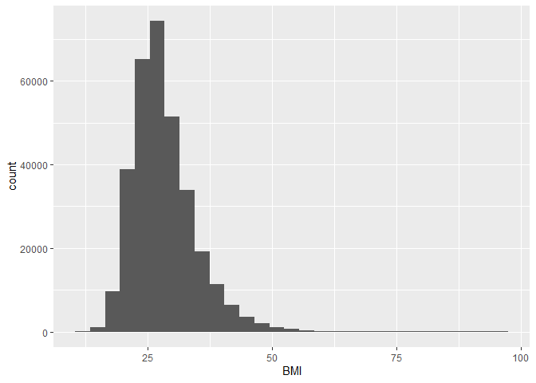<!-- -->

``` r
ds %>% ggplot(aes(BMI, fill = HeartDisease)) + geom_density(alpha=0.7)
```

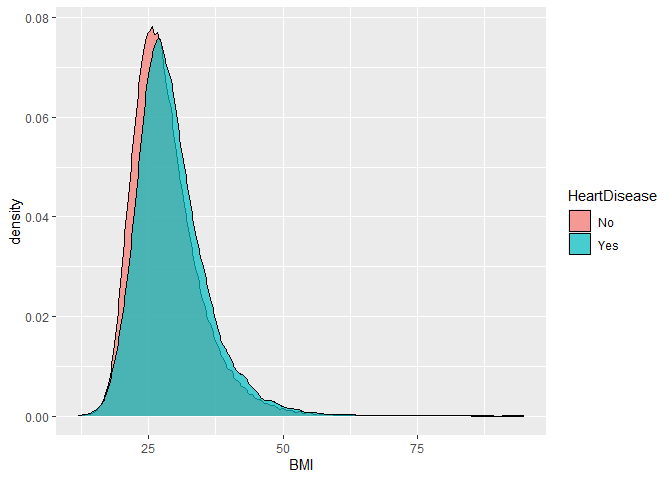<!-- -->

``` r
ds %>% ggplot(aes(BMI)) + geom_boxplot()
```

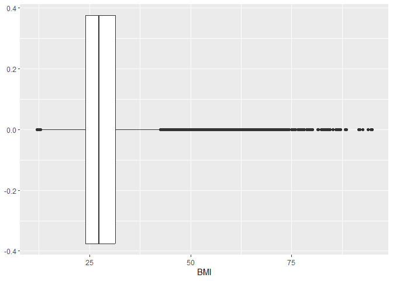<!-- -->

It appears that individuals with higher BMI are more likely to acquire
heart disease, but only marginally. Many outliers are present, but as
they are values which can be plausibly achieved and a very small portion
of the data I have opted to keep them in the dataset. I thought about
binning the values into the CDC guidelines of ‘Underweight’, ‘Healthy’,
‘Overweight’, and ‘Obese’, but it performed it performed worse so I
opted to keep it numeric.

## Smoking

``` r
ds %>% count(Smoking, HeartDisease) %>% mutate(Percentage = n/nrow(ds)*100)
```

    ##   Smoking HeartDisease      n Percentage
    ## 1      No           No 176551  55.207555
    ## 2      No          Yes  11336   3.544771
    ## 3     Yes           No 115871  36.232899
    ## 4     Yes          Yes  16037   5.014775

``` r
ds %>% ggplot(aes(Smoking, fill = HeartDisease)) + geom_bar(position = "dodge")
```

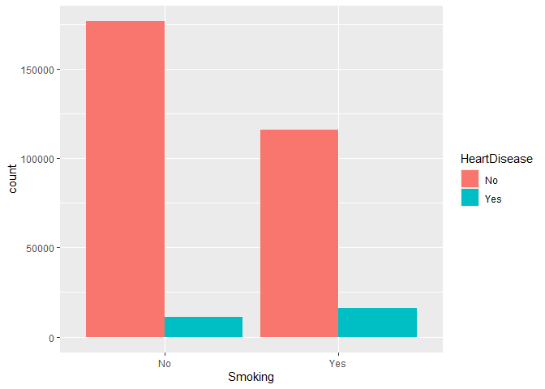<!-- -->

## AlcoholDrinking

``` r
ds %>% count(AlcoholDrinking, HeartDisease) %>% mutate(Percentage = n/nrow(ds)*100)
```

    ##   AlcoholDrinking HeartDisease      n Percentage
    ## 1              No           No 271786 84.9875702
    ## 2              No          Yes  26232  8.2027549
    ## 3             Yes           No  20636  6.4528839
    ## 4             Yes          Yes   1141  0.3567911

``` r
ds %>% ggplot(aes(AlcoholDrinking, fill = HeartDisease)) + geom_bar(position = "dodge")
```

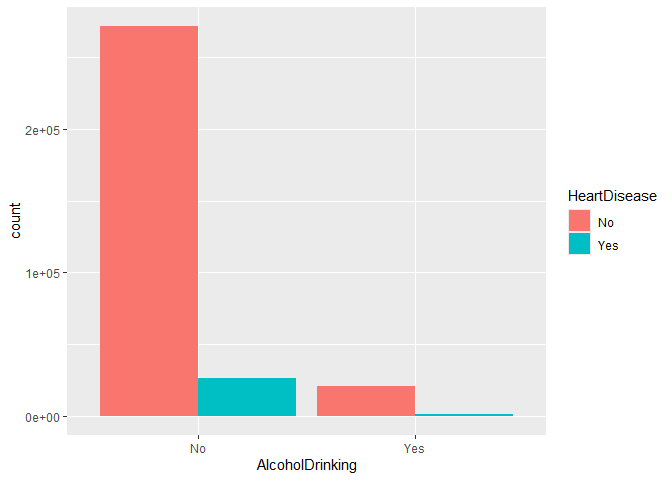<!-- -->

## Stroke

``` r
ds %>% count(Stroke, HeartDisease) %>% mutate(Percentage = n/nrow(ds)*100)
```

    ##   Stroke HeartDisease      n Percentage
    ## 1     No           No 284742  89.038916
    ## 2     No          Yes  22984   7.187104
    ## 3    Yes           No   7680   2.401538
    ## 4    Yes          Yes   4389   1.372442

``` r
ds %>% ggplot(aes(Stroke, fill = HeartDisease)) + geom_bar(position = "dodge")
```

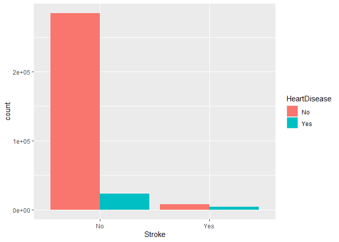<!-- -->

## PhysicalHealth

``` r
ds %>% ggplot(aes(PhysicalHealth, fill = HeartDisease)) + geom_histogram(bins=6) + facet_grid(~HeartDisease) + xlab("PhysicalHealth (Days)")
```

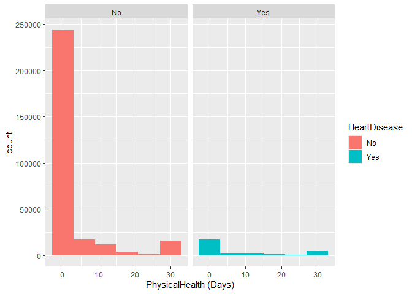<!-- -->

``` r
ds %>% ggplot(aes(PhysicalHealth)) + geom_boxplot()
```

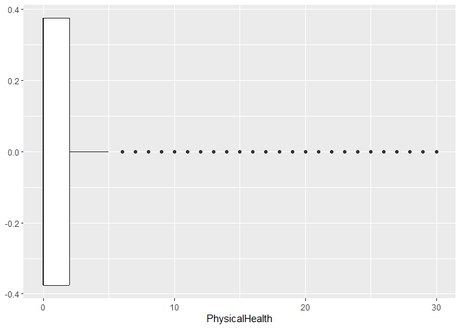<!-- -->

Extremely right skewed. Outliers are not removed as all values are
valid. Since logarithmic transformation is invalid due to “0” value edit
MentalHealth

## MentalHealth

``` r
ds %>% ggplot(aes(MentalHealth, fill = HeartDisease)) + geom_histogram(bins=6)
```

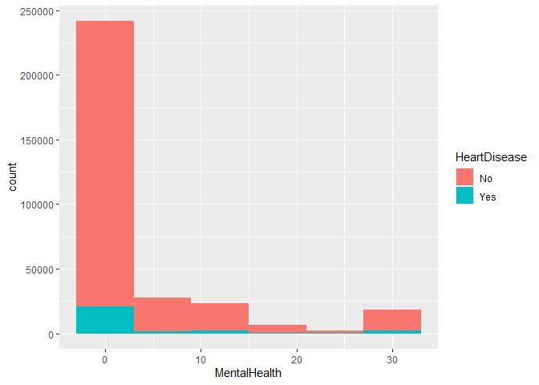<!-- -->

## DiffWalking

``` r
ds %>% count(DiffWalking, HeartDisease) %>% mutate(Percentage = n/nrow(ds)*100)
```

    ##   DiffWalking HeartDisease      n Percentage
    ## 1          No           No 258040  80.689192
    ## 2          No          Yes  17345   5.423787
    ## 3         Yes           No  34382  10.751263
    ## 4         Yes          Yes  10028   3.135759

``` r
ds %>% ggplot(aes(DiffWalking, fill = HeartDisease)) + geom_bar(position = "dodge")
```

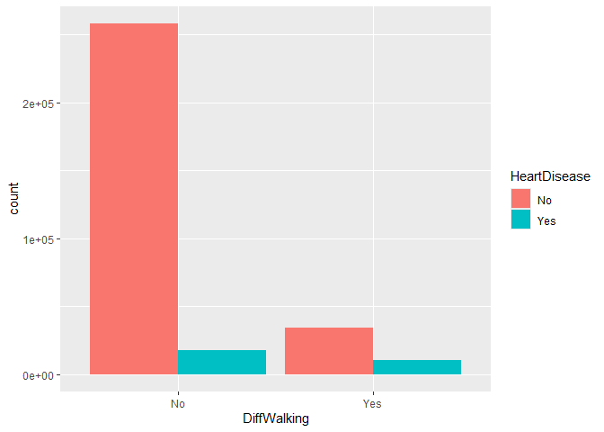<!-- -->

## Sex

``` r
ds %>% count(Sex, HeartDisease) %>% mutate(Percentage = n/nrow(ds)*100)
```

    ##      Sex HeartDisease      n Percentage
    ## 1 Female           No 156571  48.959802
    ## 2 Female          Yes  11234   3.512875
    ## 3   Male           No 135851  42.480652
    ## 4   Male          Yes  16139   5.046671

``` r
ds %>% ggplot(aes(Sex, fill = HeartDisease)) + geom_bar(position = "dodge")
```

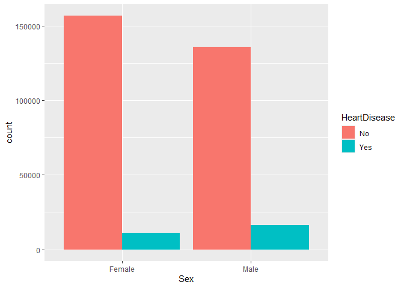<!-- -->

## AgeCategory

``` r
ds %>% count(AgeCategory, HeartDisease) %>% mutate(Percentage = n/nrow(ds)*100)
```

    ##    AgeCategory HeartDisease     n Percentage
    ## 1        18-24           No 20934 6.54606858
    ## 2        18-24          Yes   130 0.04065104
    ## 3        25-29           No 16822 5.26024484
    ## 4        25-29          Yes   133 0.04158914
    ## 5        30-34           No 18527 5.79339890
    ## 6        30-34          Yes   226 0.07067027
    ## 7        35-39           No 20254 6.33343236
    ## 8        35-39          Yes   296 0.09255930
    ## 9        40-44           No 20520 6.41661064
    ## 10       40-44          Yes   486 0.15197236
    ## 11       45-49           No 21047 6.58140371
    ## 12       45-49          Yes   744 0.23264904
    ## 13       50-54           No 23999 7.50449507
    ## 14       50-54          Yes  1383 0.43246455
    ## 15       55-59           No 27555 8.61645742
    ## 16       55-59          Yes  2202 0.68856611
    ## 17       60-64           No 30359 9.49326913
    ## 18       60-64          Yes  3327 1.04035398
    ## 19       65-69           No 30050 9.39664473
    ## 20       65-69          Yes  4101 1.28238403
    ## 21       70-74           No 26218 8.19837709
    ## 22       70-74          Yes  4847 1.51565847
    ## 23       75-79           No 17433 5.45130474
    ## 24       75-79          Yes  4049 1.26612361
    ## 25 80 or older           No 18704 5.84874685
    ## 26 80 or older          Yes  5449 1.70390406

``` r
ds %>% ggplot(aes(AgeCategory, fill = HeartDisease)) + geom_bar(position = "dodge")
```

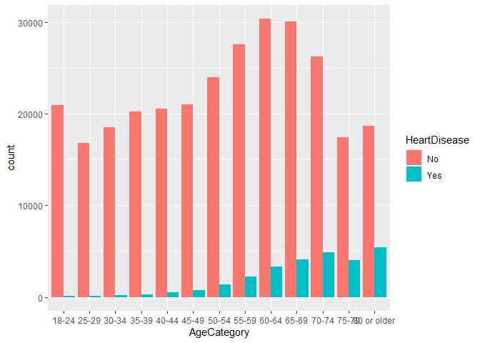<!-- -->

## Race

``` r
ds %>% count(Race, HeartDisease) %>% mutate(Percentage = n/nrow(ds)*100)
```

    ##                              Race HeartDisease      n  Percentage
    ## 1  American Indian/Alaskan Native           No   4660  1.45718351
    ## 2  American Indian/Alaskan Native          Yes    542  0.16948358
    ## 3                           Asian           No   7802  2.43968793
    ## 4                           Asian          Yes    266  0.08317829
    ## 5                           Black           No  21210  6.63237386
    ## 6                           Black          Yes   1729  0.54065886
    ## 7                        Hispanic           No  26003  8.13114652
    ## 8                        Hispanic          Yes   1443  0.45122657
    ## 9                           Other           No  10042  3.14013665
    ## 10                          Other          Yes    886  0.27705249
    ## 11                          White           No 222705 69.63992558
    ## 12                          White          Yes  22507  7.03794618

``` r
ds %>% ggplot(aes(Race, fill = HeartDisease)) + geom_bar(position = "dodge") + scale_x_discrete(labels=c("American Indian\n /Alaskan Native", "Asian", "Black", "Hispanic", "Other", "White"))
```

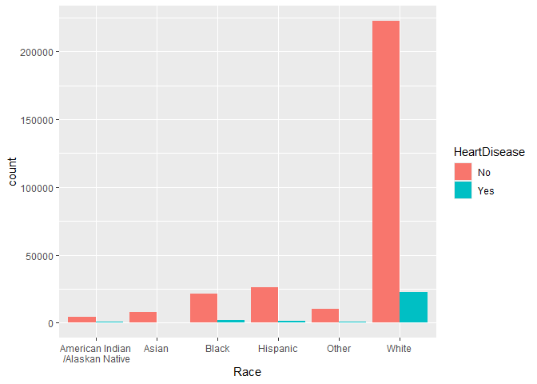<!-- -->

## Diabetic

``` r
ds %>% ggplot(aes(Diabetic)) + geom_bar()
```

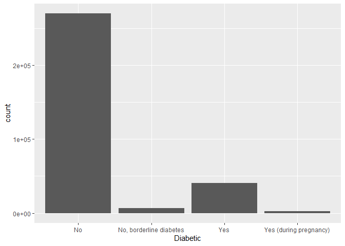<!-- -->

``` r
ds %>% ggplot(aes(Diabetic, fill = HeartDisease)) + geom_bar(position = "dodge")
```

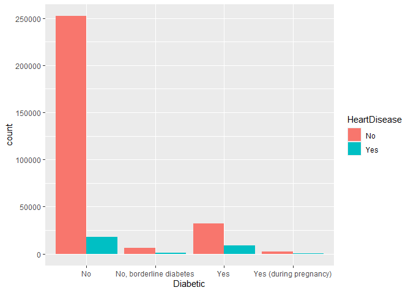<!-- -->

## PhysicalActivity

``` r
ds %>% count(PhysicalActivity, HeartDisease) %>% mutate(Percentage = n/nrow(ds)*100)
```

    ##   PhysicalActivity HeartDisease      n Percentage
    ## 1               No           No  61954  19.373036
    ## 2               No          Yes   9884   3.090730
    ## 3              Yes           No 230468  72.067418
    ## 4              Yes          Yes  17489   5.468816

``` r
ds %>% ggplot(aes(PhysicalActivity, fill = HeartDisease)) + geom_bar(position = "dodge")
```

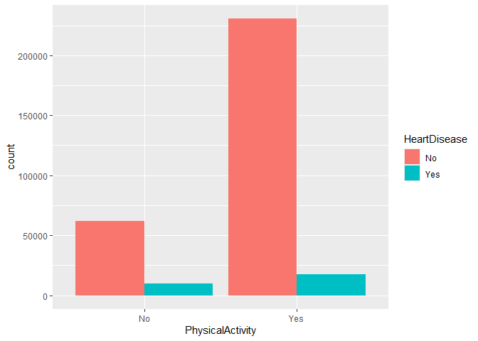<!-- -->

## GenHealth

``` r
ds %>% count(GenHealth, HeartDisease) %>% mutate(Percentage = n/nrow(ds)*100)
```

    ##    GenHealth HeartDisease      n Percentage
    ## 1  Excellent           No  65342 20.4324645
    ## 2  Excellent          Yes   1500  0.4690505
    ## 3       Fair           No  27593  8.6283400
    ## 4       Fair          Yes   7084  2.2151691
    ## 5       Good           No  83571 26.1326787
    ## 6       Good          Yes   9558  2.9887897
    ## 7       Poor           No   7439  2.3261777
    ## 8       Poor          Yes   3850  1.2038962
    ## 9  Very good           No 108477 33.9207930
    ## 10 Very good          Yes   5381  1.6826404

``` r
ds %>% ggplot(aes(GenHealth, fill = HeartDisease)) + geom_bar(position = "dodge") + scale_x_discrete(limits = c("Poor", "Fair", "Good", "Very good", "Excellent"))
```

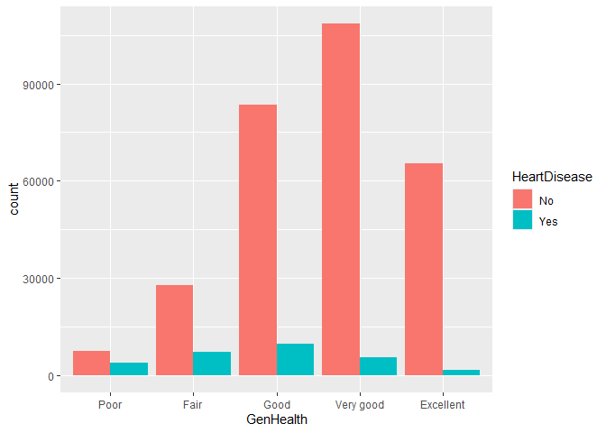<!-- -->

## SleepTime

``` r
ds %>% ggplot(aes(SleepTime, fill = HeartDisease)) + geom_bar(position = "dodge")
```

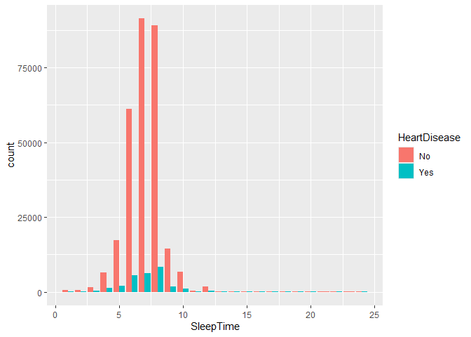<!-- -->

``` r
ds %>% ggplot(aes(SleepTime)) + geom_boxplot()
```

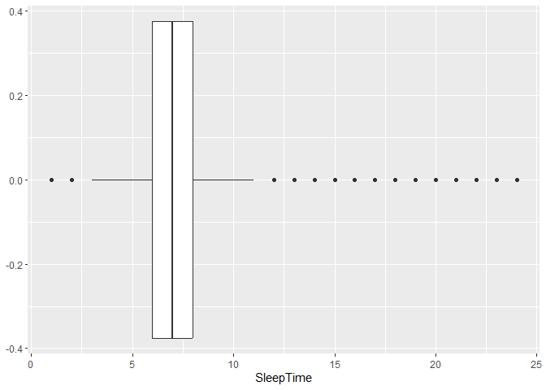<!-- -->

Outliers in SleepTime will be removed as some values are near impossible
for an individual to achieve (sleep on average 1 or 24 hours a day).
Mean and median of SleepTime being so close together along with a small
interquartile range suggests that removing these outliers will not
significantly reshape the data.

## Asthma

``` r
ds %>% count(Asthma, HeartDisease) %>% mutate(Percentage = n/nrow(ds)*100)
```

    ##   Asthma HeartDisease      n Percentage
    ## 1     No           No 254483  79.576916
    ## 2     No          Yes  22440   7.016995
    ## 3    Yes           No  37939  11.863538
    ## 4    Yes          Yes   4933   1.542551

``` r
ds %>% ggplot(aes(Asthma, fill = HeartDisease)) + geom_bar(position = "dodge")
```

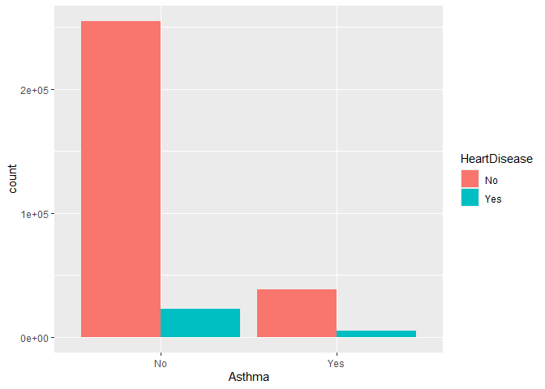<!-- -->

## KidneyDisease

``` r
ds %>% count(KidneyDisease, HeartDisease) %>% mutate(Percentage = n/nrow(ds)*100)
```

    ##   KidneyDisease HeartDisease      n Percentage
    ## 1            No           No 284098  88.837537
    ## 2            No          Yes  23918   7.479166
    ## 3           Yes           No   8324   2.602917
    ## 4           Yes          Yes   3455   1.080380

``` r
ds %>% ggplot(aes(KidneyDisease, fill = HeartDisease)) + geom_bar(position = "dodge")
```

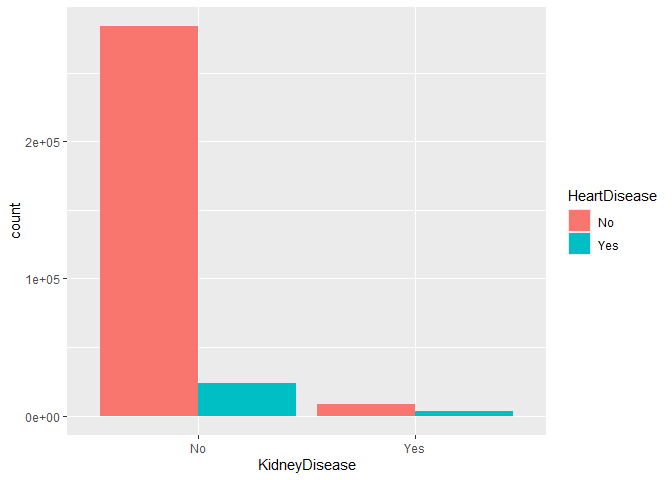<!-- -->

## SkinCancer

``` r
ds %>% count(SkinCancer, HeartDisease) %>% mutate(Percentage = n/nrow(ds)*100)
```

    ##   SkinCancer HeartDisease      n Percentage
    ## 1         No           No 267583  83.673291
    ## 2         No          Yes  22393   7.002298
    ## 3        Yes           No  24839   7.767163
    ## 4        Yes          Yes   4980   1.557248

``` r
ds %>% ggplot(aes(SkinCancer, fill = HeartDisease)) + geom_bar(position = "dodge")
```

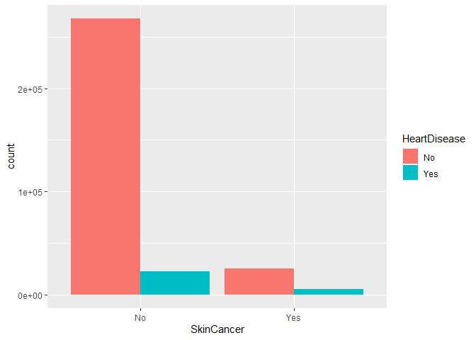<!-- -->

## Correlation

``` r
myvars <- c("HeartDisease", "Smoking", "AlcoholDrinking", "Stroke", "DiffWalking", "Sex", "AgeCategory", "Race", "Diabetic", "PhysicalActivity", "GenHealth", "Asthma", "KidneyDisease", "SkinCancer")
ds[myvars] <- lapply(ds[myvars], factor)
df_cor <- ds %>% mutate_if(is.factor, as.numeric)
corr <- cor(df_cor)
corr <- as.data.frame(as.table(corr))
reshape2::acast(corr, Var1~Var2, value.var="Freq") %>% corrplot(method="ellipse", order="AOE")
```

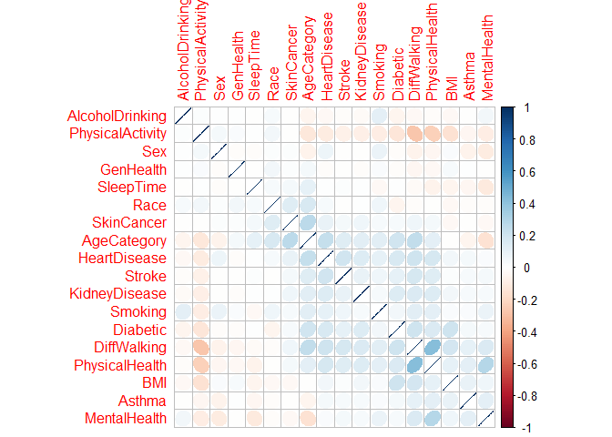<!-- -->

Changed character variables to numeric to allow for computation of
correlation. PhysicalHealth and GenHealth appear to be the most
correlated and potentially an issue, while the rest are reasonable.

# Data Cleaning & Pre-processing

``` r
ds$GenHealth <- factor(ds$GenHealth, levels=c("Excellent", "Very good", "Good", "Fair", "Poor"))
ds$AgeCategory <- factor(ds$AgeCategory, levels=c("18-24", "25-29", "30-34", "35-39", "40-44", "45-49", "50-54", "55-59", "60-64", "65-69", "70-74", "75-79", "80 or older"))
```

Ordered factor levels accordingly.

``` r
print(sum(duplicated(ds)))
```

    ## [1] 18078

``` r
ds <- distinct(ds)
```

Checked for and removed duplicate rows.

``` r
ds <- ds[!rowSums(ds[15] >10),]
ds <- ds[!rowSums(ds[15] <4),]
```

Removed outliers from SleepTime according to 1.5\*IQR leaving values of
4 to 10 hours on average per day which is reasonable.

``` r
ds <- ds %>% mutate_at(c("BMI", "PhysicalHealth", "MentalHealth", "SleepTime"), ~(scale(.) %>% as.vector))
```

Standardized numerical variables for use with regularized regression.

``` r
set.seed(123)
ds <- downSample(x=ds, y=ds$HeartDisease, list=FALSE)
ds <- ds[,-19]
ds <- ds[sample(nrow(ds), nrow(ds)),]
```

Undersampled to balance classes of target variable.

``` r
s <- sample(nrow(ds), nrow(ds)*0.8)
dsTrain <- ds[s,]
dsTest <- ds[-s,]
rownames(dsTrain) = NULL
rownames(dsTest) = NULL
```

Created train and test sets to use for validation and testing predictive
power of model.

``` r
xTrain <- model.matrix(HeartDisease~., dsTrain)[,-1]
yTrain <- as.matrix(dsTrain[,1])
xTest <- model.matrix(HeartDisease~., dsTest)[,-1]
yTest <- as.matrix(dsTest[,1])
```

``` r
dsDummy <- dummy_cols(ds, select_columns= c("Smoking","AlcoholDrinking", "Stroke", "DiffWalking", "Sex", "AgeCategory", "Race", "Diabetic", "PhysicalActivity", "GenHealth", "Asthma", "KidneyDisease", "SkinCancer"), remove_selected_columns=TRUE)
s <- sample(nrow(dsDummy), nrow(dsDummy)*0.8)
dsTraind <- dsDummy[s,]
dsTestd <- dsDummy[-s,]
xTraind <- as.matrix(dsTraind[,-1])
yTraind <- dsTraind[,1]
yTraind <- as.numeric(yTraind)
yTraind <- ifelse(yTraind == 1, -1, 1)
xTestd <- as.matrix(dsTestd[,-1])
yTestd <- as.matrix(dsTestd[,1])
```

Split train and test sets by target variable and introduces dummy
variables.

------------------------------------------------------------------------

# Models

## Unregularized Logistic Regression

``` r
train_control <- trainControl(method = "cv", number = 10)
logi <- train(HeartDisease~., trControl=train_control, method="glm", family="binomial", data=dsTrain)
summary(logi)
```

    ## 
    ## Call:
    ## NULL
    ## 
    ## Deviance Residuals: 
    ##     Min       1Q   Median       3Q      Max  
    ## -3.0874  -0.8039   0.1411   0.8258   2.9176  
    ## 
    ## Coefficients:
    ##                                   Estimate Std. Error z value Pr(>|z|)    
    ## (Intercept)                       -3.97127    0.14881 -26.687  < 2e-16 ***
    ## BMI                                0.03004    0.01313   2.288 0.022165 *  
    ## SmokingYes                         0.33382    0.02483  13.446  < 2e-16 ***
    ## AlcoholDrinkingYes                -0.27998    0.05333  -5.250 1.52e-07 ***
    ## StrokeYes                          1.20822    0.05261  22.965  < 2e-16 ***
    ## PhysicalHealth                     0.04745    0.01324   3.583 0.000340 ***
    ## MentalHealth                       0.03722    0.01297   2.869 0.004115 ** 
    ## DiffWalkingYes                     0.24714    0.03433   7.199 6.08e-13 ***
    ## SexMale                            0.74141    0.02518  29.449  < 2e-16 ***
    ## `AgeCategory25-29`                 0.04983    0.15744   0.316 0.751644    
    ## `AgeCategory30-34`                 0.57543    0.13852   4.154 3.27e-05 ***
    ## `AgeCategory35-39`                 0.68704    0.13312   5.161 2.45e-07 ***
    ## `AgeCategory40-44`                 1.02128    0.12807   7.974 1.53e-15 ***
    ## `AgeCategory45-49`                 1.27422    0.12355  10.313  < 2e-16 ***
    ## `AgeCategory50-54`                 1.73042    0.11929  14.505  < 2e-16 ***
    ## `AgeCategory55-59`                 2.02246    0.11716  17.262  < 2e-16 ***
    ## `AgeCategory60-64`                 2.36199    0.11593  20.375  < 2e-16 ***
    ## `AgeCategory65-69`                 2.58586    0.11553  22.384  < 2e-16 ***
    ## `AgeCategory70-74`                 2.87444    0.11574  24.836  < 2e-16 ***
    ## `AgeCategory75-79`                 3.07293    0.11748  26.157  < 2e-16 ***
    ## `AgeCategory80 or older`           3.39904    0.11728  28.983  < 2e-16 ***
    ## RaceAsian                         -0.50000    0.13689  -3.653 0.000259 ***
    ## RaceBlack                         -0.31051    0.10161  -3.056 0.002243 ** 
    ## RaceHispanic                      -0.15905    0.10204  -1.559 0.119075    
    ## RaceOther                          0.01645    0.11264   0.146 0.883870    
    ## RaceWhite                         -0.03206    0.09125  -0.351 0.725346    
    ## `DiabeticNo, borderline diabetes`  0.18047    0.07394   2.441 0.014660 *  
    ## DiabeticYes                        0.47411    0.03168  14.965  < 2e-16 ***
    ## `DiabeticYes (during pregnancy)`   0.15140    0.15964   0.948 0.342936    
    ## PhysicalActivityYes                0.03883    0.02882   1.347 0.177871    
    ## `GenHealthVery good`               0.43649    0.04293  10.168  < 2e-16 ***
    ## GenHealthGood                      0.95876    0.04268  22.464  < 2e-16 ***
    ## GenHealthFair                      1.47044    0.05147  28.566  < 2e-16 ***
    ## GenHealthPoor                      1.87548    0.07525  24.925  < 2e-16 ***
    ## SleepTime                         -0.05263    0.01189  -4.428 9.52e-06 ***
    ## AsthmaYes                          0.27104    0.03479   7.791 6.64e-15 ***
    ## KidneyDiseaseYes                   0.54420    0.05171  10.523  < 2e-16 ***
    ## SkinCancerYes                      0.10756    0.03594   2.993 0.002764 ** 
    ## ---
    ## Signif. codes:  0 '***' 0.001 '**' 0.01 '*' 0.05 '.' 0.1 ' ' 1
    ## 
    ## (Dispersion parameter for binomial family taken to be 1)
    ## 
    ##     Null deviance: 57822  on 41709  degrees of freedom
    ## Residual deviance: 41667  on 41672  degrees of freedom
    ## AIC: 41743
    ## 
    ## Number of Fisher Scoring iterations: 5

``` r
predict(logi, newdata=dsTest, s="lambda.1se") %>% confusionMatrix(., dsTest$HeartDisease)
```

    ## Confusion Matrix and Statistics
    ## 
    ##           Reference
    ## Prediction   No  Yes
    ##        No  3856 1120
    ##        Yes 1381 4071
    ##                                           
    ##                Accuracy : 0.7602          
    ##                  95% CI : (0.7518, 0.7683)
    ##     No Information Rate : 0.5022          
    ##     P-Value [Acc > NIR] : < 2.2e-16       
    ##                                           
    ##                   Kappa : 0.5204          
    ##                                           
    ##  Mcnemar's Test P-Value : 2.004e-07       
    ##                                           
    ##             Sensitivity : 0.7363          
    ##             Specificity : 0.7842          
    ##          Pos Pred Value : 0.7749          
    ##          Neg Pred Value : 0.7467          
    ##              Prevalence : 0.5022          
    ##          Detection Rate : 0.3698          
    ##    Detection Prevalence : 0.4772          
    ##       Balanced Accuracy : 0.7603          
    ##                                           
    ##        'Positive' Class : No              
    ## 

Unregularized logistic regression model acts as base model to compare
results.

## LASSO

``` r
cv.lasso <- cv.glmnet(xTrain, yTrain, family="binomial", alpha=1, nfolds=10)
cv.lasso
```

    ## 
    ## Call:  cv.glmnet(x = xTrain, y = yTrain, nfolds = 10, family = "binomial",      alpha = 1) 
    ## 
    ## Measure: Binomial Deviance 
    ## 
    ##        Lambda Index Measure       SE Nonzero
    ## min 0.0001294    76   1.001 0.004938      36
    ## 1se 0.0021095    46   1.006 0.004569      34

``` r
coef(cv.lasso)
```

    ## 38 x 1 sparse Matrix of class "dgCMatrix"
    ##                                          s1
    ## (Intercept)                     -2.69380062
    ## BMI                              0.02886200
    ## SmokingYes                       0.34497559
    ## AlcoholDrinkingYes              -0.23886459
    ## StrokeYes                        1.16062689
    ## PhysicalHealth                   0.05296791
    ## MentalHealth                     0.01273795
    ## DiffWalkingYes                   0.26808890
    ## SexMale                          0.68304717
    ## AgeCategory25-29                -0.86963025
    ## AgeCategory30-34                -0.41790155
    ## AgeCategory35-39                -0.32680360
    ## AgeCategory40-44                -0.01531779
    ## AgeCategory45-49                 0.10673757
    ## AgeCategory50-54                 0.57001898
    ## AgeCategory55-59                 0.86724087
    ## AgeCategory60-64                 1.20518934
    ## AgeCategory65-69                 1.42835852
    ## AgeCategory70-74                 1.71239331
    ## AgeCategory75-79                 1.89815370
    ## AgeCategory80 or older           2.21327150
    ## RaceAsian                       -0.36930201
    ## RaceBlack                       -0.18814709
    ## RaceHispanic                    -0.08998932
    ## RaceOther                        .         
    ## RaceWhite                        0.03365333
    ## DiabeticNo, borderline diabetes  0.13674544
    ## DiabeticYes                      0.48832810
    ## DiabeticYes (during pregnancy)   .         
    ## PhysicalActivityYes              .         
    ## GenHealthVery good               0.25805152
    ## GenHealthGood                    0.78194910
    ## GenHealthFair                    1.28338728
    ## GenHealthPoor                    1.66336072
    ## SleepTime                       -0.04041397
    ## AsthmaYes                        0.22143251
    ## KidneyDiseaseYes                 0.51689598
    ## SkinCancerYes                    0.11562012

``` r
plot(cv.lasso)
```

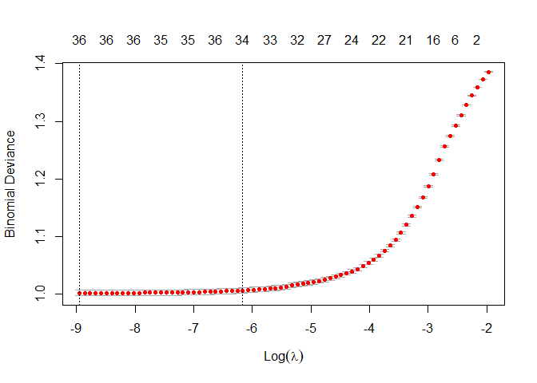<!-- -->

``` r
cv.lasso$lambda.1se
```

    ## [1] 0.002109509

``` r
lasso <- glmnet(xTrain, yTrain, family="binomial", alpha=1, lambda=cv.lasso$lambda.1se)
lassopred <- predict(lasso, newx=xTest, type="class", s=cv.lasso$lambda.1se)
confusionMatrix(table(lassopred, yTest))
```

    ## Confusion Matrix and Statistics
    ## 
    ##          yTest
    ## lassopred   No  Yes
    ##       No  3893 1171
    ##       Yes 1344 4020
    ##                                          
    ##                Accuracy : 0.7588         
    ##                  95% CI : (0.7505, 0.767)
    ##     No Information Rate : 0.5022         
    ##     P-Value [Acc > NIR] : < 2.2e-16      
    ##                                          
    ##                   Kappa : 0.5177         
    ##                                          
    ##  Mcnemar's Test P-Value : 0.0006042      
    ##                                          
    ##             Sensitivity : 0.7434         
    ##             Specificity : 0.7744         
    ##          Pos Pred Value : 0.7688         
    ##          Neg Pred Value : 0.7494         
    ##              Prevalence : 0.5022         
    ##          Detection Rate : 0.3733         
    ##    Detection Prevalence : 0.4856         
    ##       Balanced Accuracy : 0.7589         
    ##                                          
    ##        'Positive' Class : No             
    ## 

``` r
rmseTrainLasso <- sqrt(cv.lasso$cvm[cv.lasso$lambda==cv.lasso$lambda.1se])
rmseTrainLasso
```

    ## [1] 1.002763

LASSO performs simiarly to unregularized while offering a more
parsimonious model; however, levels in factor variables are omitted from
the model which makes interpretation a bit confusing. To remedy this we
use group LASSO.

## Group LASSO

``` r
group <- c(1,2,3,4,5,5,6,6,7,7,8,8,9,9,10,10,10,10,10,10,10,10,10,10,10,10,10,11,11,11,11,11,11,12,12,12,12,13,13,14,14,14,14,14,15,15,16,16,17,17)
grplasso <- cv.gglasso(xTraind, yTraind, loss="logit", group=group, pred.loss = "misclass", lambda.factor=0.05, nfolds=10)
coef(grplasso$gglasso.fit, s=grplasso$lambda.1se)
```

    ##                                                1
    ## (Intercept)                          0.555158977
    ## BMI                                  0.000000000
    ## PhysicalHealth                       0.154359374
    ## MentalHealth                        -0.018479713
    ## SleepTime                            0.000000000
    ## Smoking_No                          -0.161906348
    ## Smoking_Yes                          0.161609045
    ## AlcoholDrinking_No                   0.000000000
    ## AlcoholDrinking_Yes                  0.000000000
    ## Stroke_No                           -0.383626889
    ## Stroke_Yes                           0.381160975
    ## DiffWalking_No                      -0.225423634
    ## DiffWalking_Yes                      0.225731631
    ## Sex_Female                          -0.231806659
    ## Sex_Male                             0.231351652
    ## AgeCategory_18-24                   -0.323343253
    ## AgeCategory_25-29                   -0.278049228
    ## AgeCategory_30-34                   -0.274816155
    ## AgeCategory_35-39                   -0.297693006
    ## AgeCategory_40-44                   -0.254056642
    ## AgeCategory_45-49                   -0.211593348
    ## AgeCategory_50-54                   -0.117287191
    ## AgeCategory_55-59                   -0.021932526
    ## AgeCategory_60-64                    0.126691363
    ## AgeCategory_65-69                    0.231616077
    ## AgeCategory_70-74                    0.396168142
    ## AgeCategory_75-79                    0.418877803
    ## AgeCategory_80 or older              0.605061547
    ## Race_American Indian/Alaskan Native  0.000000000
    ## Race_Asian                           0.000000000
    ## Race_Black                           0.000000000
    ## Race_Hispanic                        0.000000000
    ## Race_Other                           0.000000000
    ## Race_White                           0.000000000
    ## Diabetic_No                         -0.232605640
    ## Diabetic_No, borderline diabetes     0.004572091
    ## Diabetic_Yes                         0.240342411
    ## Diabetic_Yes (during pregnancy)     -0.013111334
    ## PhysicalActivity_No                  0.000000000
    ## PhysicalActivity_Yes                 0.000000000
    ## GenHealth_Excellent                 -0.462025670
    ## GenHealth_Very good                 -0.280330864
    ## GenHealth_Good                       0.112144695
    ## GenHealth_Fair                       0.349451351
    ## GenHealth_Poor                       0.280209310
    ## Asthma_No                            0.000000000
    ## Asthma_Yes                           0.000000000
    ## KidneyDisease_No                    -0.090524679
    ## KidneyDisease_Yes                    0.090058514
    ## SkinCancer_No                       -0.107131302
    ## SkinCancer_Yes                       0.107368651

``` r
grplassopred <- predict(grplasso, xTestd, type="class")
yTestd2 <- ifelse(yTestd=="Yes", 1, -1)
confusionMatrix(table(grplassopred, yTestd2))
```

    ## Confusion Matrix and Statistics
    ## 
    ##             yTestd2
    ## grplassopred   -1    1
    ##           -1 3977 1513
    ##           1  1226 3712
    ##                                           
    ##                Accuracy : 0.7373          
    ##                  95% CI : (0.7288, 0.7458)
    ##     No Information Rate : 0.5011          
    ##     P-Value [Acc > NIR] : < 2.2e-16       
    ##                                           
    ##                   Kappa : 0.4747          
    ##                                           
    ##  Mcnemar's Test P-Value : 4.636e-08       
    ##                                           
    ##             Sensitivity : 0.7644          
    ##             Specificity : 0.7104          
    ##          Pos Pred Value : 0.7244          
    ##          Neg Pred Value : 0.7517          
    ##              Prevalence : 0.4989          
    ##          Detection Rate : 0.3814          
    ##    Detection Prevalence : 0.5265          
    ##       Balanced Accuracy : 0.7374          
    ##                                           
    ##        'Positive' Class : -1              
    ## 

Group LASSO now omits factor variables fully, taking a bit of a hit in
predictive power in exchange for a more comprehensible and lean model.

## kNN

``` r
ds$HeartDisease <- factor(ds$HeartDisease)
trainIndex <- createDataPartition(ds$HeartDisease, times = 1, p = 0.8, list=FALSE)
dsTrain <- ds[trainIndex,]
dsTest <- ds[-trainIndex,]

knnModel <- train(HeartDisease~., data=ds, method="knn", 
                  trControl = trainControl(method="cv"),
                  tuneGrid = data.frame(k = c(3, 5, 7, 229)))

best_model <- knn3(HeartDisease~., data=dsTrain, k = knnModel$bestTune$k)
predictions <- predict(best_model, dsTest, type = "class")
confusionMatrix(predictions, dsTest$HeartDisease)
```

    ## Confusion Matrix and Statistics
    ## 
    ##           Reference
    ## Prediction   No  Yes
    ##        No  3846 1386
    ##        Yes 1367 3827
    ##                                           
    ##                Accuracy : 0.7359          
    ##                  95% CI : (0.7274, 0.7444)
    ##     No Information Rate : 0.5             
    ##     P-Value [Acc > NIR] : <2e-16          
    ##                                           
    ##                   Kappa : 0.4719          
    ##                                           
    ##  Mcnemar's Test P-Value : 0.7316          
    ##                                           
    ##             Sensitivity : 0.7378          
    ##             Specificity : 0.7341          
    ##          Pos Pred Value : 0.7351          
    ##          Neg Pred Value : 0.7368          
    ##              Prevalence : 0.5000          
    ##          Detection Rate : 0.3689          
    ##    Detection Prevalence : 0.5018          
    ##       Balanced Accuracy : 0.7359          
    ##                                           
    ##        'Positive' Class : No              
    ## 

Used sqrt(n) along with 3, 5, 7 for k parameter. 229 was chosen to be
the best fitting.

## Random Forest

``` r
split <- initial_split(dsTrain, prop =0.3, strata = HeartDisease)
ds2 <- training(split)
split <- initial_split(ds2, prop = 0.8, strata = HeartDisease)
rfTrain <- training(split)
rfTest <- testing(split)
rf <- randomForest(HeartDisease~., data = rfTrain, proximity = TRUE)
print(rf)
```

    ## 
    ## Call:
    ##  randomForest(formula = HeartDisease ~ ., data = rfTrain, proximity = TRUE) 
    ##                Type of random forest: classification
    ##                      Number of trees: 500
    ## No. of variables tried at each split: 4
    ## 
    ##         OOB estimate of  error rate: 24.7%
    ## Confusion matrix:
    ##       No  Yes class.error
    ## No  3509 1495   0.2987610
    ## Yes  977 4027   0.1952438

``` r
pre <- predict(rf, rfTest)
confusionMatrix(pre, rfTest$HeartDisease)
```

    ## Confusion Matrix and Statistics
    ## 
    ##           Reference
    ## Prediction   No  Yes
    ##        No   855  250
    ##        Yes  397 1002
    ##                                          
    ##                Accuracy : 0.7416         
    ##                  95% CI : (0.724, 0.7587)
    ##     No Information Rate : 0.5            
    ##     P-Value [Acc > NIR] : < 2.2e-16      
    ##                                          
    ##                   Kappa : 0.4832         
    ##                                          
    ##  Mcnemar's Test P-Value : 9.476e-09      
    ##                                          
    ##             Sensitivity : 0.6829         
    ##             Specificity : 0.8003         
    ##          Pos Pred Value : 0.7738         
    ##          Neg Pred Value : 0.7162         
    ##              Prevalence : 0.5000         
    ##          Detection Rate : 0.3415         
    ##    Detection Prevalence : 0.4413         
    ##       Balanced Accuracy : 0.7416         
    ##                                          
    ##        'Positive' Class : No             
    ## 

``` r
hist(treesize(rf))
```

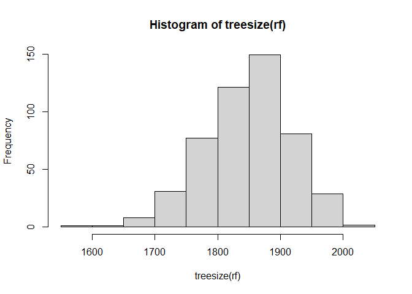<!-- -->

``` r
varImpPlot(rf, sort = T)
```

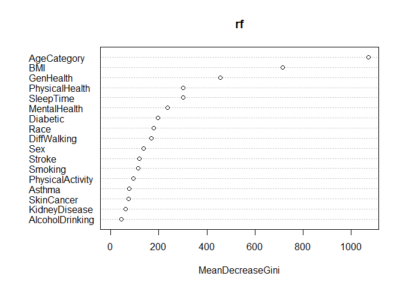<!-- -->

``` r
rfRem <- rfTrain %>% select(c("HeartDisease", "AgeCategory", "BMI", "GenHealth", "SleepTime", "PhysicalHealth", "MentalHealth"))
rf2 <- randomForest(HeartDisease~., data = rfRem)
pre3 <- predict(rf2, rfTest)
confusionMatrix(pre3, rfTest$HeartDisease)
```

    ## Confusion Matrix and Statistics
    ## 
    ##           Reference
    ## Prediction  No Yes
    ##        No  827 255
    ##        Yes 425 997
    ##                                           
    ##                Accuracy : 0.7284          
    ##                  95% CI : (0.7106, 0.7458)
    ##     No Information Rate : 0.5             
    ##     P-Value [Acc > NIR] : < 2.2e-16       
    ##                                           
    ##                   Kappa : 0.4569          
    ##                                           
    ##  Mcnemar's Test P-Value : 9.12e-11        
    ##                                           
    ##             Sensitivity : 0.6605          
    ##             Specificity : 0.7963          
    ##          Pos Pred Value : 0.7643          
    ##          Neg Pred Value : 0.7011          
    ##              Prevalence : 0.5000          
    ##          Detection Rate : 0.3303          
    ##    Detection Prevalence : 0.4321          
    ##       Balanced Accuracy : 0.7284          
    ##                                           
    ##        'Positive' Class : No              
    ## 

Random forest performs slightly worse than LASSO and on par with kNN.
Creating a more parsimonious model with the top six importance predictor
variables yields a small performance hit but a much less costly model.
